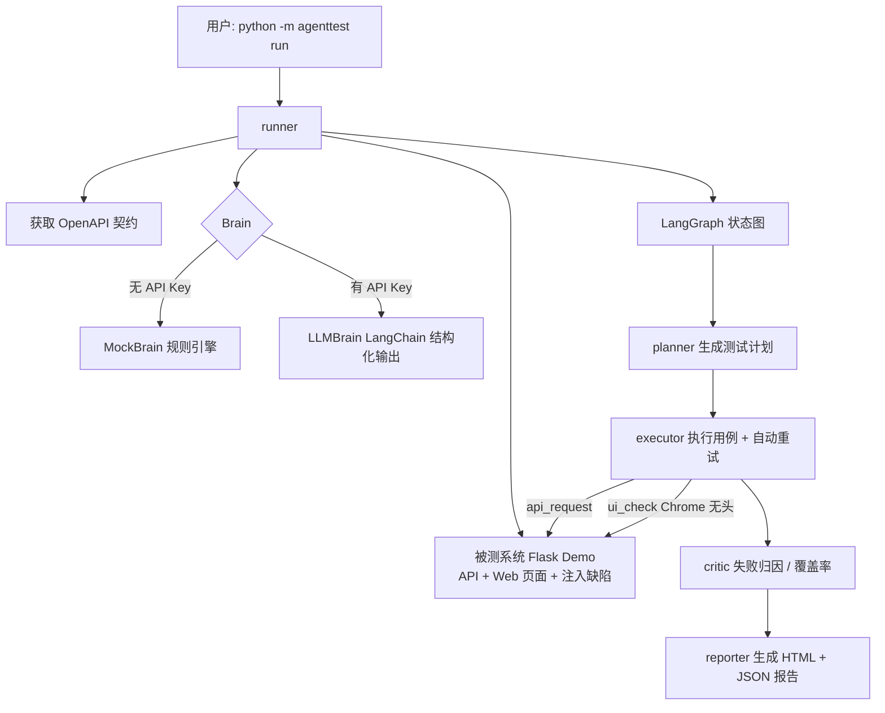
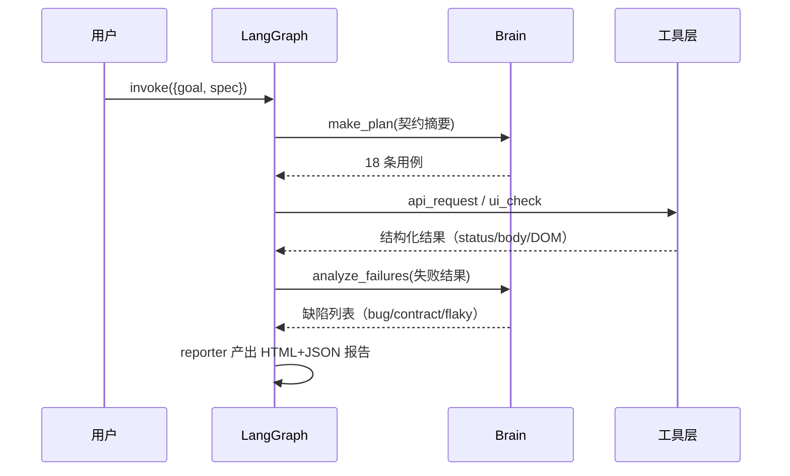

# 🤖 AgentTest Hub — Agent 自动测试系统

> 一个项目，同时打通 **软件测试工程师** 与 **Agent 开发工程师** 两条求职路线。
>
> LangGraph + LangChain 编排的 **API + Web UI 双覆盖** 自动化测试系统：Agent 从 OpenAPI 契约生成测试计划、执行测试、自动重试、归因缺陷、产出可视化报告。
>
> 📄 **在线测试报告（GitHub Pages）**：https://lefan17.github.io/agent-test-hub/report.html
>
> 🧪 **配套实践项目**：[software-testing-practice](https://github.com/lefan17/software-testing-practice) —— 契约驱动的接口自动化测试实践：Flask 被测系统 + 27 条登录接口 pytest 用例 + 用例设计/测试报告/SQL 数据校验文档（测试基本功配套仓库）

## 为什么这个项目能同时投两个岗位

| 视角 | 体现的能力 | 对应简历点 |
| --- | --- | --- |
| **软件测试工程师** | 测试用例设计（正/反/边界/契约）、缺陷发现与归因、测试报告、pytest 工程化、OpenAPI 契约测试、Flaky 处理 | 接口自动化、UI 自动化、测试框架搭建、缺陷管理 |
| **Agent 开发工程师** | LangGraph 状态机编排、LangChain 结构化输出、Tool 抽象与 ReAct 设计、LLM 降级方案、可观测 trace、确定性工具设计 | Agent 框架使用、Prompt 工程、LLM 应用落地、系统设计 |

## 核心特性

- **契约驱动**：从被测系统 `/openapi.json` 读取 OpenAPI 规范，自动生成/推导测试用例
- **API + UI 双覆盖**：接口断言 + 真实浏览器（Chrome 无头）渲染断言与截图
- **智能缺陷归因**：失败用例由 Brain（LLM 或规则引擎）自动归类为 bug / contract / flaky / environment
- **自动重试**：对 5xx / 网络异常自动重试（指数退避），区分「不稳定」与「真缺陷」
- **双 Brain 可切换**：`MockBrain`（规则引擎，离线可跑、演示确定性）+ `LLMBrain`（LangChain 结构化输出，接 DeepSeek/OpenAI/通义等）
- **可观测**：报告含 Agent 思考轨迹（trace）、覆盖率、证据与截图
- **自带被测系统**：Flask Demo 应用注入 3 个真实缺陷，Agent 演示「发现缺陷」而非「跑一遍全绿」

## 架构



## 快速开始（Windows）

> 完整操作手册（安装/运行/配置 LLM/故障排查/二次开发）见 [**docs/操作指南.md**](docs/操作指南.md)

### 1. 环境要求

- Python 3.9+（推荐 3.10+，本项目在 3.12 上验证）
- 本机装有 Chrome 或 Edge（用于 UI 自动化；没有也不影响 API 测试）
- 可选：DeepSeek / OpenAI / 通义等任意 OpenAI 兼容 API Key

### 2. 一键安装并运行

```bash
# Git Bash / WSL / macOS
bash scripts/demo.sh

# Windows CMD / PowerShell 双击即可
scripts\demo.bat
```

或手动执行：

```bash
python -m venv .venv
.venv/Scripts/python.exe -m pip install -r requirements.txt   # Windows
# .venv/bin/python -m pip install -r requirements.txt          # Linux/macOS

.venv/Scripts/python.exe -m agenttest run
```

跑完打开 `reports/report.html` 查看报告。

## 常用命令

```bash
# 全量运行（API + UI，默认 MockBrain，无需 Key）
.venv/Scripts/python.exe -m agenttest run

# 只跑 API 用例
.venv/Scripts/python.exe -m agenttest run --no-ui

# 使用真实 LLM 规划与归因（需配置 Key）
.venv/Scripts/python.exe -m agenttest run --force-llm

# 运行项目自身的测试套件（展示测试功底）
.venv/Scripts/python.exe -m pytest
```

## 配置真实 LLM（可选）

复制 `.env.example` 为 `.env` 并填写，或直接设置环境变量：

```bash
export AGENTTEST_LLM_API_KEY=sk-xxxx
export AGENTTEST_LLM_BASE_URL=https://api.deepseek.com/v1   # 以 DeepSeek 为例
export AGENTTEST_LLM_MODEL=deepseek-chat
```

配置后运行 `--force-llm`，Agent 会真正调用 LLM：读取契约摘要 → 结构化生成 12~20 条用例 → 失败结果交给 LLM 归因。未配置 Key 时自动降级 MockBrain，保证离线可演示。

## 被测系统与注入缺陷

`demo_app/` 是一个带缺陷的待办清单服务（Flask），契约在 `demo_app/openapi.json`：

| 缺陷 | 位置 | 契约要求 | 实际行为 |
| --- | --- | --- | --- |
| BUG-API-001 契约不符 | `GET /api/todos?status=invalid` | 400 | 500 |
| BUG-API-002 缺失参数校验 | `POST /api/todos` 空 title | 400 且不落库 | 200 且写入脏数据 |
| FLAKY-001 不稳定服务 | `GET /api/flaky` | 200 | 约 10% 概率 503（触发 Agent 重试） |

运行一次演示，Agent 会发现前两个缺陷，并在 trace 中展示重试过程。

## 工作原理

### LangGraph 四节点流水线



### 设计要点（面试可直接讲）

1. **Brain 抽象**：`BaseBrain` 协议同时被规则引擎与 LLM 实现——展示「AI 能力可替换」的系统设计，也保证无 Key 时可演示、CI 可回归。
2. **确定性工具层**：Agent 只负责「决策」（规划/归因），执行走确定性代码（requests / Chrome 无头），结果可复现——这是测试系统的基本要求。
3. **结构化输出**：LLMBrain 用 `with_structured_output` 把 LLM 输出约束为 Pydantic 模型，杜绝自由文本解析的脆弱性。
4. **可观测性**：每个节点写入 trace，报告呈现完整思考轨迹——调试、演示、面试都能用。
5. **失败重试与归因分离**：5xx/网络错误自动重试（最多 3 次），仍失败才进入 critic 归因，避免把 Flaky 误报成 Bug。

## 项目结构

```
├─ agenttest/            # Agent 主包
│  ├─ brain/             # MockBrain（规则引擎）/ LLMBrain（LangChain）
│  ├─ graph/             # LangGraph：state / nodes / build
│  ├─ tools/             # api_request / ui_check / fetch_openapi
│  ├─ report/            # HTML 报告渲染
│  ├─ config.py / models.py / runner.py
├─ demo_app/             # 被测系统（Flask + OpenAPI + 注入缺陷）
├─ tests/                # 项目自身 pytest（28 通过 + 2 项缺陷基准 xfail）
├─ docs/                 # 简历描述 / 面试 QA / 架构文档
├─ scripts/              # demo.bat / demo.sh 一键演示
├─ reports/              # 运行产物（HTML/JSON 报告 + 截图）
└─ requirements.txt / pyproject.toml
```

## 常见问题

- **没有 Chrome 会怎样？** UI 用例会失败并在报告中标注「UI 后端不可用」，API 用例照常；也可 `--no-ui` 跳过。
- **UI 自动化为什么不用 Selenium/Playwright？** 项目默认用系统 Chrome 无头模式（`--dump-dom` + 截图），零驱动零下载；同时内置 Selenium 后端，`--ui-backend selenium` 可切换，体现多方案能力。
- **怎么把 MockBrain 换成真 LLM？** 配置 `AGENTTEST_LLM_*` 环境变量后加 `--force-llm`。
- **Python 3.8 能跑吗？** 不行，LangChain/LangGraph 需要 3.9+；本机验证用 Python 3.12。

## License

MIT
