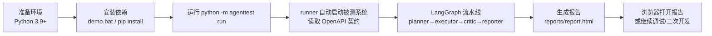

# AgentTest Hub 操作指南

> 面向使用者的完整操作手册：环境准备 → 安装 → 运行演示 → 配置真实 LLM → 测试套件 → 故障排查 → 二次开发。

## 1. 总体流程



## 2. 环境准备

### 2.1 版本要求

| 组件 | 要求 | 说明 |
| --- | --- | --- |
| Python | 3.9+（推荐 3.10+） | LangChain/LangGraph 不支持 3.8；本项目在 3.12 上验证 |
| 浏览器 | Chrome 或 Edge（可选） | 用于 UI 自动化；缺失时 API 测试不受影响 |
| LLM Key | 可选 | 配置后可用真实 LLM 规划/归因；不配置自动用 MockBrain |

### 2.2 确认 Python 版本

```bash
python --version   # 若 < 3.9，改用 py -3 或指定解释器路径
py -3 --version    # Windows Python 启动器
```

> ⚠️ 注意：如果本机默认 `python` 是 3.8（部分机器存在），请用 `py -3`，或直接指定 3.10+ 解释器的完整路径创建虚拟环境，例如：

```bash
py -3 -m venv .venv
# 或指定具体解释器
C:/path/to/python3.12.exe -m venv .venv
```

## 3. 安装

### 方式 A：一键脚本（推荐）

**Windows**：双击 `scripts\demo.bat`（首次运行会自动创建虚拟环境并安装依赖，约 1~2 分钟）。

**Git Bash / WSL / macOS / Linux**：

```bash
bash scripts/demo.sh
```

### 方式 B：手动安装

```bash
cd C:\Users\lefan\DSH_project\DH_1

# 1. 创建虚拟环境
python -m venv .venv

# 2. 安装依赖（Windows）
.venv\Scripts\python.exe -m pip install -r requirements.txt

# 2'. 安装依赖（Linux/macOS）
# .venv/bin/python -m pip install -r requirements.txt
```

安装完成后，后续所有命令都通过 `.venv` 内的解释器执行，避免污染全局环境。

## 4. 运行演示（核心操作）

### 4.1 标准运行

```bash
.venv\Scripts\python.exe -m agenttest run
```

运行过程（无需任何 API Key）：

1. runner 检测 `http://127.0.0.1:5001` 是否有被测系统，没有则在本进程内自动启动 Flask Demo；
2. 从被测系统拉取 `openapi.json` 契约；
3. 未配置 LLM → 自动选用 MockBrain（规则引擎），生成 18 条用例；
4. LangGraph 依次执行 planner → executor（API 断言 + Chrome 无头 UI 断言，5xx 自动重试）→ critic（归因缺陷）→ reporter（写报告）；
5. 控制台逐条输出 PASS/FAIL 与 Agent 思考轨迹，最后打印报告路径。

### 4.2 预期输出（摘录）

```text
[planner] mock 生成 18 条测试用例
[executor] FAIL API-006 非法 status 过滤应返回 400（契约要求） (期望 400 / 实际 500 ... / 重试2次)
[executor] FAIL API-008 空 title 创建应返回 400（契约要求） (期望 400 / 实际 200 ...)
[critic] 失败 2/18，归因出 2 个缺陷
[critic]   DEF-001 [high/contract] 契约不符：非法参数应返回 400 却返回 500
[critic]   DEF-002 [high/bug] 缺失参数校验：空值被接受并写入数据
[reporter] 报告已生成: report.html（JSON: report.json）
```

### 4.3 查看报告

```bash
start reports\report.html        # Windows
open reports/report.html         # macOS
```

报告内容：

- **汇总卡片**：用例总数 / 通过 / 失败 / 发现缺陷数；
- **缺陷区**：每个缺陷的严重级别、类别（bug/contract/flaky）、证据与修复建议；
- **用例明细表**：ID、标题、期望 vs 实际、PASS/FAIL 徽标、耗时、重试标记、UI 截图；
NaN
- **Agent 思考轨迹**：完整 trace，可审计 Agent 每一步决策。

## 5. 命令参考

| 命令 | 说明 |
| --- | --- |
| `python -m agenttest run` | 全量运行（API + UI，默认 MockBrain） |
| `python -m agenttest run --no-ui` | 只跑 API 用例（15 条） |
| `python -m agenttest run --force-llm` | 强制使用真实 LLM（需配置 Key） |
| `python -m agenttest run --report-dir out` | 指定报告输出目录 |
| `python -m agenttest run --demo-url http://host:port` | 指向外部被测系统（本机已有服务时复用） |
| `python -m agenttest run --ui-backend selenium` | UI 后端切换为 Selenium（需 chromedriver） |
| `python -m agenttest run --max-attempts 5` | 调整失败重试次数（默认 3） |
| `python -m agenttest run --keep-server` | 跑完后保留被测系统，方便手动浏览 |
| `python -m agenttest run --goal "自定义测试目标"` | 自定义目标（LLM 模式会据此规划） |

## 6. 配置真实 LLM（可选）

### 6.1 方式一：`.env` 文件（推荐）

```bash
cd C:\Users\lefan\DSH_project\DH_1
copy .env.example .env      # Windows
# cp .env.example .env      # Linux/macOS
```

编辑 `.env`（以 DeepSeek 为例）：

```ini
AGENTTEST_LLM_API_KEY=sk-你的Key
AGENTTEST_LLM_BASE_URL=https://api.deepseek.com/v1
AGENTTEST_LLM_MODEL=deepseek-chat
```

> 支持任意 OpenAI 兼容接口：OpenAI（`https://api.openai.com/v1`、`gpt-4o-mini`）、通义（`https://dashscope.aliyuncs.com/compatible-mode/v1`）等。

### 6.2 方式二：环境变量

```bash
# Windows CMD
set AGENTTEST_LLM_API_KEY=sk-你的Key
set AGENTTEST_LLM_BASE_URL=https://api.deepseek.com/v1
set AGENTTEST_LLM_MODEL=deepseek-chat

# Git Bash / macOS
export AGENTTEST_LLM_API_KEY=sk-你的Key
export AGENTTEST_LLM_BASE_URL=https://api.deepseek.com/v1
export AGENTTEST_LLM_MODEL=deepseek-chat
```

### 6.3 验证

```bash
.venv\Scripts\python.exe -m agenttest run --force-llm
```

预期：`[runner] Brain = llm（LLM: deepseek-chat）`，LLM 会根据契约结构化生成 12~20 条用例，并对失败结果做归因。

> 提示：`--force-llm` 但未配置 Key 时会报错退出；未加 `--force-llm` 且无 Key 时自动降级 MockBrain，不会失败。

## 7. 运行项目自身测试套件

```bash
.venv\Scripts\python.exe -m pytest
```

预期结果：**28 passed, 2 xfailed**（2 个 xfail 是注入缺陷的回归基准——如果被测系统某天修好了，测试会 XPASS 提醒你更新基准）。

只跑部分测试：

```bash
.venv\Scripts\python.exe -m pytest tests/test_api_tool.py       # 工具集成测试
.venv\Scripts\python.exe -m pytest tests/test_runner_e2e.py     # 端到端（必须发现缺陷）
.venv\Scripts\python.exe -m pytest tests/test_demo_app.py       # 被测系统功能测试
```

## 8. 单独启动被测系统（手动体验）

```bash
.venv\Scripts\python.exe demo_app\app.py
```

浏览器访问：

| 地址 | 内容 |
| --- | --- |
| `http://127.0.0.1:5001/` | 首页 |
| `http://127.0.0.1:5001/login` | 登录页 |
| `http://127.0.0.1:5001/todos` | 待办清单页 |
| `http://127.0.0.1:5001/api/health` | 健康检查（JSON） |
| `http://127.0.0.1:5001/openapi.json` | OpenAPI 契约 |

也可以用 `--keep-server` 在演示后保留服务，方便对照报告手动验证缺陷（例如访问 `/api/todos?status=invalid` 会返回 500）。

## 9. 目录速查

```
agenttest/          Agent 主包
  brain/            MockBrain（规则引擎）/ LLMBrain（LangChain）
  graph/            LangGraph 状态图与节点
  tools/            执行工具（api_request / ui_check / fetch_openapi）
  report/           HTML 报告渲染
  config.py         配置（支持 .env）
  runner.py         CLI 入口
demo_app/           被测系统（Flask + 注入缺陷 + OpenAPI）
tests/              pytest 测试套件
docs/               简历描述 / 面试QA / 架构文档
scripts/            一键演示脚本（demo.bat / demo.sh）
reports/            运行产物（report.html / report.json / 截图）
```

## 10. 故障排查

### 10.1 端口 5001 被占用

报错 `Address already in use`：

- 换端口：先改 `demo_app/app.py` 的端口，再 `--demo-url http://127.0.0.1:新端口`；
- 或停掉占用 5001 的进程（`netstat -ano | findstr 5001` → `taskkill /PID 进程号 /F`）。

### 10.2 找不到 Chrome / UI 用例失败

- 报「UI 后端不可用」：设置 `AGENTTEST_CHROME_PATH` 指向浏览器可执行文件；
- 或切换后端：`--ui-backend selenium`（需 chromedriver 可用）；
- 或跳过 UI：`--no-ui`（API 照常）。

### 10.3 控制台中文乱码 / 编码报错

项目已内置 UTF-8 强制输出；若仍异常，手动指定：

```bash
PYTHONIOENCODING=utf-8 .venv\Scripts\python.exe -m agenttest run
```

### 10.4 安装失败

- 确认 Python ≥ 3.9：`python --version`；
- 网络受限时使用镜像源：`pip install -r requirements.txt -i https://pypi.tuna.tsinghua.edu.cn/simple`；
- 删除 `.venv` 后重新执行一键脚本。

### 10.5 `--force-llm` 报错

- 确认 `.env` 已配置且被读取（`AGENTTEST_LLM_API_KEY` 非空）；
- 确认模型名与 base_url 匹配（DeepSeek 用 `deepseek-chat` + `/v1`）；
- 网络能访问该 API 域名。

## 11. 二次开发指引

### 11.1 加一条 API 用例

编辑 `agenttest/brain/mock_brain.py` 的 `make_plan`，追加：

```python
TestCase(id="API-016", title="新接口冒烟", kind="api", priority="P1",
         method="GET", path="/api/stats", expected_status=200),
```

### 11.2 加一条 UI 检查

```python
TestCase(id="UI-004", title="统计页检查", kind="ui", priority="P2",
         url=f"{base_url}/stats",
         checks=[Check(type="contains_text", target="统计"),
                 Check(type="has_element", target="[data-testid=stats]")]),
```

### 11.3 换一个被测系统

1. 新系统暴露 `/openapi.json`（或改 `agenttest/tools/spec_tool.py` 的契约地址）；
2. `--demo-url` 指向新系统；
3. MockBrain 用例模板按新契约调整（或直接用 `--force-llm` 让 LLM 按契约自动规划）。

### 11.4 新增工具

在 `agenttest/tools/` 下实现函数，在 `tools/__init__.py` 导出，然后在 `graph/nodes.py` 的 executor 中按需调用（保持工具确定性，不要让 LLM 直接执行代码）。

### 11.5 日常开发循环

```bash
# 改代码 → 跑测试 → 跑演示 → 看报告
.venv\Scripts\python.exe -m pytest -q
.venv\Scripts\python.exe -m agenttest run
start reports\report.html
```

## 12. 常见疑问速答

- **没配 Key 能演示吗？** 能，自动用 MockBrain，全程离线。
- **演示会污染数据吗？** 被测系统是内存存储，进程退出即重置；每次运行都是干净种子数据。
- **报告能发给别人吗？** 可以，`report.html` 是自包含单文件（截图与 HTML 同目录，一起打包即可）。
- **想固定用某家 LLM？** 改 `.env` 三个变量即可，无需改代码。
