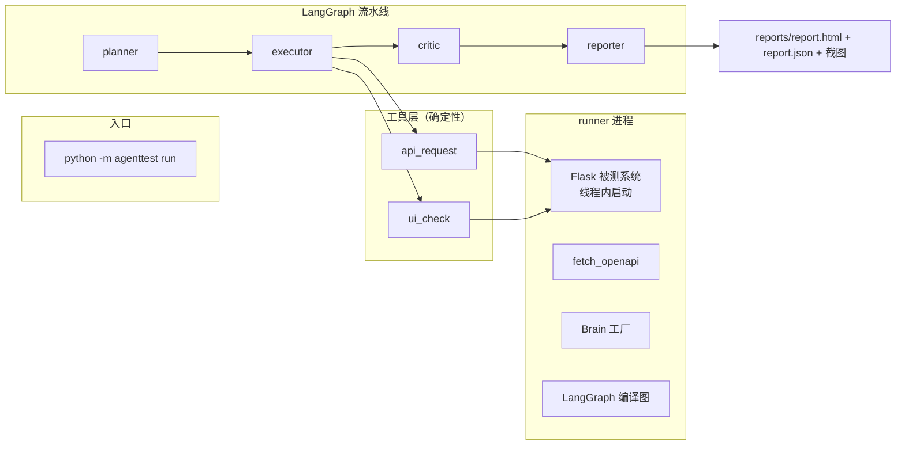

# 架构与设计决策

## 系统全景

## 状态定义（AgentState）

| 字段 | 类型 | 说明 |
| --- | --- | --- |
| goal | str | 本次测试目标 |
| spec | dict | OpenAPI 契约 |
| cases | list[TestCase] | 测试计划 |
| results | list[TestResult] | 执行结果 |
| defects | list[Defect] | 归因缺陷 |
| coverage | dict | 端点→用例映射 |
| trace | Annotated[list, add] | 可追加的思考轨迹 |
| context | dict | 环境上下文（base_url/UI后端等） |
| report | dict | 报告文件路径 |

## 节点职责

- **planner**：调用 Brain.make_plan(spec) → 用例列表；支持 --no-ui 过滤
- **executor**：逐条执行；API 走 requests，UI 走 Chrome 无头；5xx/网络错误重试（退避 0.3s×attempt，最多 cfg.max_attempts=3）；记录 attempts/retried/耗时
- **critic**：Brain.analyze_failures(results) → 缺陷；计算 coverage
- **reporter**：组装 TestReport，写 JSON（model_dump_json）与 HTML（Jinja2），截图与报告同目录

## Brain 两种实现

| 能力 | MockBrain（规则引擎） | LLMBrain（LangChain） |
| --- | --- | --- |
| 规划 | 内置 18 条正/反/边界/契约用例模板 | with_structured_output 生成 12~20 条 |
| 归因 | 规则映射（400→500 契约不符 / 400→200 校验缺失 / 503 flaky） | LLM 读失败 JSON 输出缺陷列表 |
| 依赖 | 无 | langchain-openai + API Key |
| 用途 | 离线演示 / CI / 单测 | 智能规划与复杂归因 |

## 关键设计决策

1. **契约即真相**：以 openapi.json 为基准生成契约符合性用例，实现与契约偏差即为缺陷——符合「契约测试」工程实践。
2. **决策/执行分离**：LLM 概率性输出绝不进入断言路径；确定性工具层保证结果可复现。
3. **失败分级**：重试解决「暂时性失败」，归因解决「本质性失败」，两者分离避免统计污染。
4. **可观测优先**：trace 贯穿全流程，报告可审计，演示有说服力。
5. **可移植**：Brain 协议 + OpenAI 兼容接口 + 浏览器抽象，换模型/换被测系统成本低。

## 测试策略（项目自身的质量保障）

| 层级 | 文件 | 覆盖 |
| --- | --- | --- |
| 单元 | test_mock_brain.py / test_report.py | 规划与归因逻辑、报告渲染 |
| 集成 | test_api_tool.py / test_ui_tool.py | 工具对真实服务的调用 |
| 功能 | test_demo_app.py | 被测系统行为 + 2 项缺陷 xfail 基准 |
| 端到端 | test_runner_e2e.py | 全流程必须发现 contract+bug 缺陷并产出报告 |
